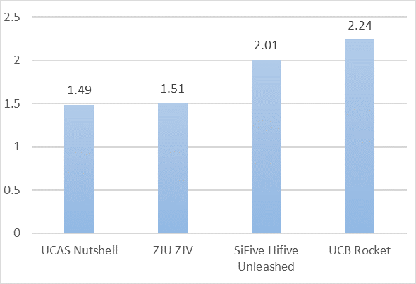
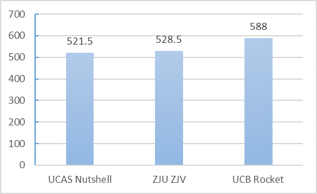
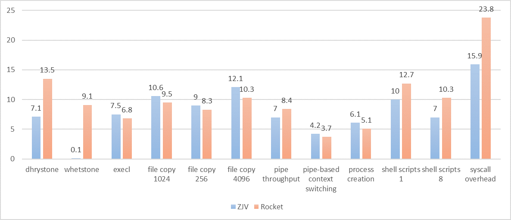
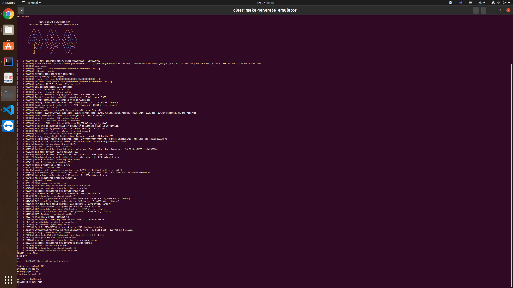

ZJV SoC
=======

**ZJV is a 10-stage in-order RISC-V 64 core capable of booting Linux and Debian on FPGA.** It is named after  Zhejiang University (**ZJ**U) and RISC-**V**.

This document gives a quick overview on the design of ZJV , testing it with Spike (the RISC-V ISA Simulator), and booting Debian on FPGA with ZJV core. In fact, given the correct device tree, the latest version of Rocket example system is also compatible with the SoC.


## Build

```bash
# Install packages
sudo apt install default-jdk verilator device-tree-compiler curl gnupg make gcc g++

# Install sbt
echo "deb https://dl.bintray.com/sbt/debian /" | sudo tee -a /etc/apt/sources.list.d/sbt.list
curl -sL "https://keyserver.ubuntu.com/pks/lookup?op=get&search=0x2EE0EA64E40A89B84B2DF73499E82A75642AC823" | sudo apt-key add
sudo apt-get update
sudo apt-get install sbt

# Clone repository
git clone https://github.com/riscv-zju/zjv-core.git
cd zjv-core
git submodule update --init --recursive --progress
```

From here, we can choose to run ZJV on simulator with several test cases ported from riscv-tests and a additional cross-page 32-bit instruction test. Otherwise, we can run ZJV on FPGA.


## Run ZJV on Simulator to Difftest with Spike

```bash
# Differential test with Spike
make generate_testcase
make generate_emulator
```

Then,  emulator will run all test cases from our https://github.com/riscv-zju/zjv-soc-test/commits/yzq repository, which is based on riscv-tests. This repository is included as a submodule.

We have also ported coremark, rt-thread, xv6 and Linux with BBL on ZJV simulation environment. Below are the links of the corresponding repositories.

Rt-thread is in https://github.com/riscv-zju/rt-thread/commits/master.

Coremark is in https://github.com/riscv-zju/coremark. Because simulation is slow, our number of iterations is small and coremark will claim the result illegal. We can change the number of testing iterations and our time-base frequency in  `portme.h` and `portme.c`.

Xv6 is in https://github.com/riscv-zju/xv6-riscv. We know that `exec` may load an ELF image and run it. This may result in I-Cache and D-Cache coherency problem. Consequently, we add `fence.i` instruction to fix this problem.

Linux is wrapped in BBL. https://github.com/riscv-zju/riscv-rss-sdk/tree/zjv is the repository. Just run `make bbl`.


## Run ZJV on FPGA

Currently, ZJV is able to boot Debian on Nexys A7 with SoC (https://github.com/riscv-zju/zjv-fpga-acc) provided in the repository. However, it will be soon replaced by Starship (https://github.com/riscv-zju/riscv-starship).

1. Before generating FPGA verilog source code, **we need to modify `src/main/scala/config/config.scala` and set `fpga = true` and `enable_pec = false`**.

```bash
# generate FPGA verilog source code
make generate_fpga
```

2. Then we change current directory to `zjv-fpga-acc`. **According to the README.md in `zjv-fpga-acc`, we can setup the hardware Vivado project with a first stage bootloader ready for any bare-metal or operating system.**
3. **Re-compile the software using the DTS and configuration according to README.md in  `zjv-fpga-acc`.**


## Config and DTS

### Config

1. L1 cache is configurable in `src/main/scala/mem/cache_common.CacheConfig.totalSize`. The default is 4 KB each. Caution! Do **not** change `lines` variable in that class. L2 cache is 16 KB by default.
2. Some basic configs are in `src/main/scala/config/config.scala`, change `fpga` and `enable_pec` for running on FPGA and using cryptographic extension.

### Physical Address Space Definition

Address space is defined in `src/main/scala/mem/addrspace.scala`. It varies from different configs, shown as below.

Here, UART in FPGA and simulator are different. The former has 4 byte offset (0x0, 0x4, 0x8 ...) while the latter has 1 byte offset (0x0, 0x1, 0x2 ...).

```scala
object AddressSpace extends phvntomParams with projectConfig {
  def mmio =
    if (fpga || ila) {
        // On FPGA
        // (0x10000000L, 0x02000000L)  // MMIO Out of Tile : SPI UART BRAM
        //    (0x10001000L, 0x00001000L) // UART 13bit (because of Vivado's UART IP Design)
        //    (0x10010000L, 0x00010000)  // BRAM for bootloader 16bit
        //    (0X10030000L, 0x00010000)  // SPI 16bit to connect SD card
        // (0x02000000L, 0x00010000L)  // CLINT
        // (0x0c000000L, 0x04000000L)  // PLIC
        // (0x80000000L, undecidedL )  // SDRAM
      List( // (start, size)
        (0x10000000L, 0x02000000L), // MMIO Out of Tile : SPI UART BRAM (UART same as QEMU)
        (0x02000000L, 0x00010000L), // CLINT same as QEMU
        (0x0c000000L, 0x04000000L)  // PLIC same as QEMU
      )
    } else {	// if (diffTest with Spike)
      List( // (start, size)
        (0x40000000L, 0x1000000L), // dummy flash
        (0x000100L, 0x10L), // POWEROFFF
        (0x2000000L, 0x10000L), // CLINT
        (0xc000000L, 0x4000000L), // PLIC
        (0x10000000L, 0x100L) // uart        
      )
    }

  def isMMIO(addr: UInt) =
    mmio
      .map(range => addr >= range._1.U && addr < (range._1 + range._2).U)
      .reduce(_ || _)
}
```

### DTS

DTS  (device tree source) is used by Linux. Just see the device tree in `zjv-fpga-acc` to compile Linux for booting Debian on FPGA. Specifically, timebase frequency is 100 times lower than CPU frequency in ZJV design.

### PLIC

This is a platform level interrupt controller. We need to modify hardware in `src/main/scala/device/AXI4PLIC.scala` and DTS to correctly guide the interrupt to the corresponding context (a privilege level of a hart). Currently we only reserve one input for UART. Details are in SiFive manual.


## Performance

ZJV is better than Rocket at frequency. However, with similar cache size and BTB size, Rocket is with higher overall performance.

ZJV is slightly better than Nutshell () at both frequency and IPC in coremark, even with half instruction, data and L2 cache size.

Below are the results of coremark (mark/MHz), coremark (mark) and UnixBench on FPGA.










## TODO

1. A new design of better performance to embrace the 2nd version of ZJV. A dual-issue 7-stage in-order pipeline. Support RV64 IMACFDV and Tilelink.
2. Fix mcounteren and scounteren bug.
3. DMA support.
4. Use Starship to replace zjv-fpga-acc.
5. Design a NPU prototype and port full software stack in our ZJV SoC.
